# Practice_2_Horbach_program

**З дисципліни:** «ООП»

**На тему:** « LINQ »

## ПОСТАНОВКА ЗАДАЧІ

**Завдання:**
1. Клонувати репозиторій:
https://github.com/IlonaShevchenko/Practice_Linq.git

У проєкті є частковий код:

  - опис класу FootballGame, який описує футбольний матч (FootballGame.сs);
  - у файлі Program.cs вже реалізований метод ReadFromFileJson(), який десеріалізаціє json-файл (data/results_2010.json) у колекцію List<FootballGame>;
  - також у файлі Program.cs повністю реалізований метод Main().

Склонований проєкт має запускатися і виводити на екран тестове значення 13049 (це кількість всіх матчів збірних, які були проведені з 2010 року включно).

2.  Необхідно реалізувати методи Query1(), Query2(), …, Query10(), шаблони цих методів наявні в проєкті. Завдання (запити для реалізації) див. у вигляді коментарів до кожного методу.

Крім запиту у кожному методі має бути реалізований вивід на екран результатів запиту (приклад оформлення виводу див. файл output.txt).

3. Для проєкту має бути створений власний локальний і віддалений репозиторії. Після реалізації кожного методу QueryN() необхідно робити коміт, вказуючи номер N реалізованого запиту.

4. Оформити Readme.md файл.

# ВИКОНАННЯ РОБОТИ

**Загальні відомості**

Мова програмування - С#

Операційна система - Windows 11 Home PL

Тип процесора - Intel(R) Core(TM) i5-1035G1 CPU @ 1.00GHz   1.20 GHz

Тип компілятора - Visual Studio 2022

**Реалізація запитів за допомогою LINQ**

Запит 1: Вивести всі матчі, які відбулися в Україні у 2012 році.
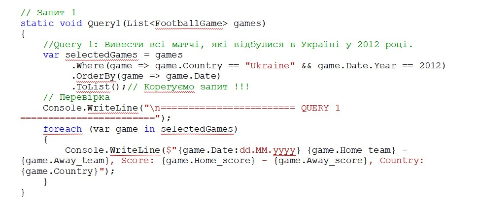

Запит 2: Вивести Friendly матчі збірної Італії, які вона провела з 2020 року.
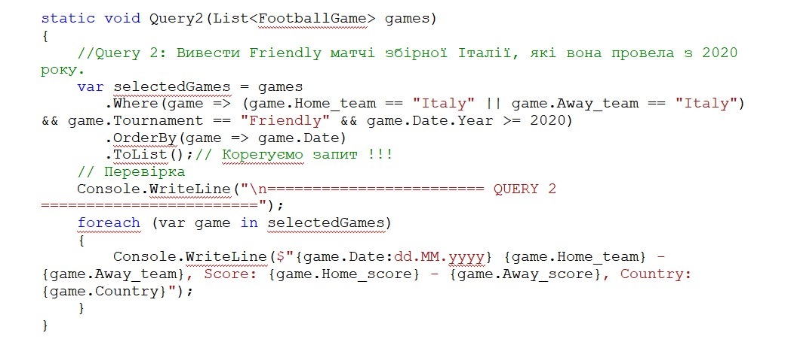

Запит 3: Вивести всі домашні матчі збірної Франції за 2021 рік, де вона зіграла у нічию.
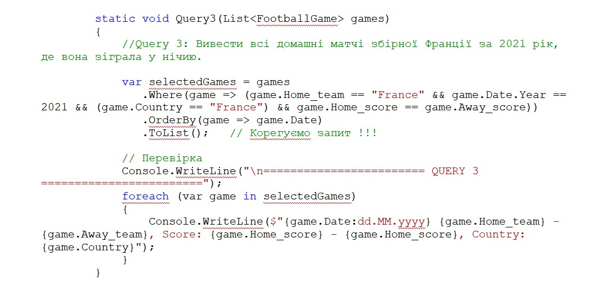

Запит 4: Вивести всі матчі збірної Германії з 2018 року по 2020 рік (включно), в яких вона на виїзді програла.
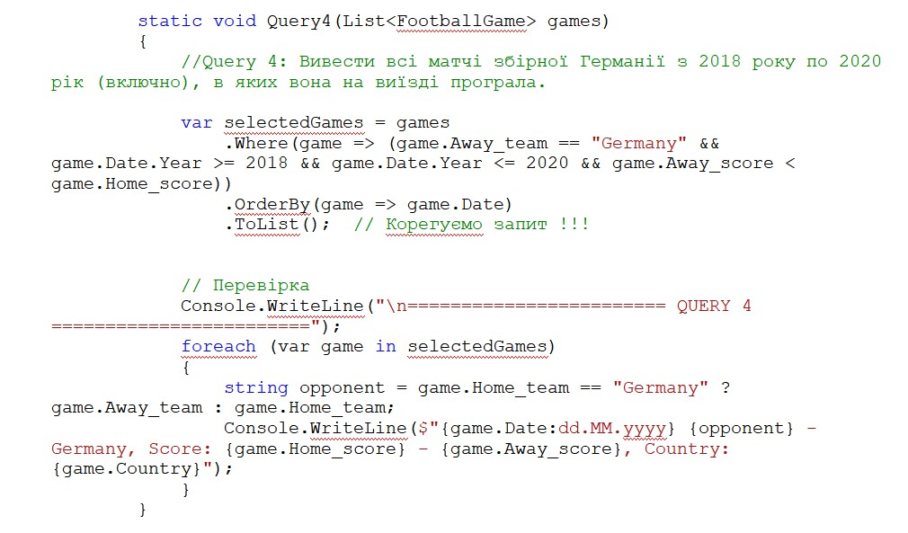

Запит 5: Вивести всі кваліфікаційні матчі (UEFA Euro qualification), які відбулися у Києві чи у Харкові, а також за умови перемоги української збірної.
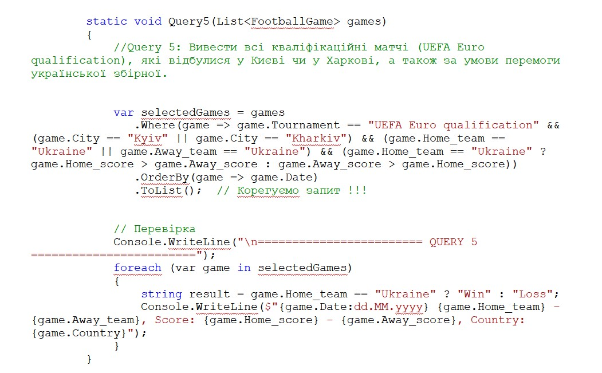

Запит 6: Вивести всі матчі останнього чемпіоната світу з футболу (FIFA World Cup), починаючи з чвертьфіналів (тобто останні 8 матчів). Матчі мають відображатися від фіналу до чвертьфіналів (тобто у зворотній послідовності).
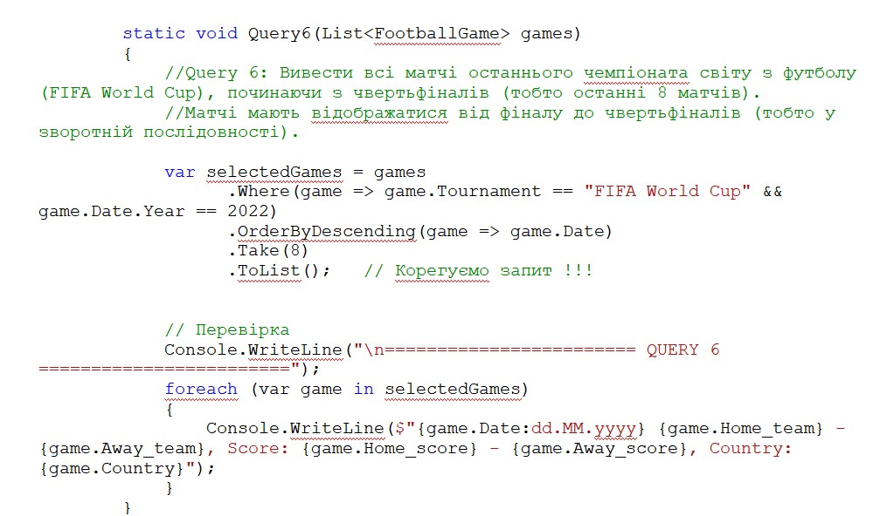

Запит 7: Вивести перший матч у 2023 році, в якому збірна України виграла.
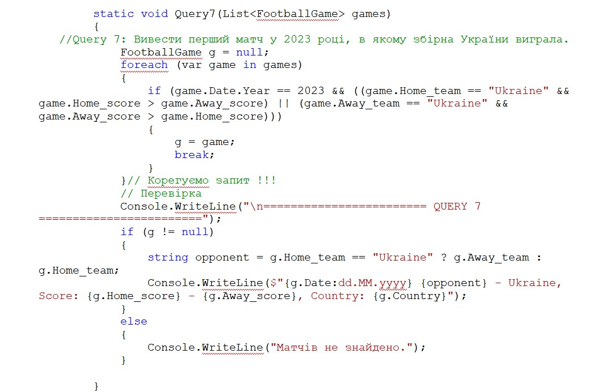

Запит 8: Перетворити всі матчі Євро-2012 (UEFA Euro), які відбулися в Україні, на матчі з наступними властивостями: MatchYear - рік матчу, Team1 - назва приймаючої команди, Team2 - назва гостьової команди, Goals - сума всіх голів за матч
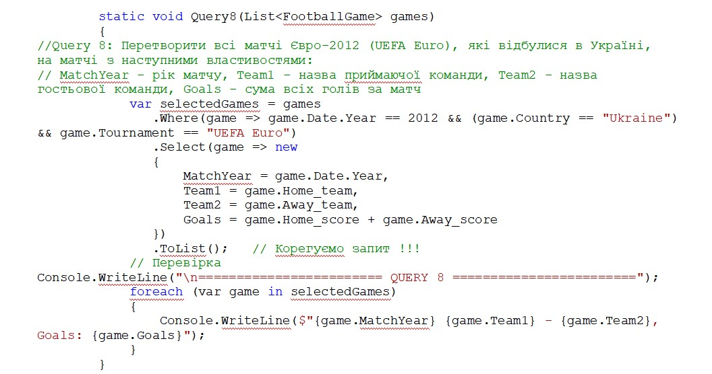

Запит 9: Перетворити всі матчі UEFA Nations League у 2023 році на матчі з наступними властивостями: MatchYear - рік матчу, Game - назви обох команд через дефіс (першою - Home_team), Result - результат для першої команди (Win, Loss, Draw)
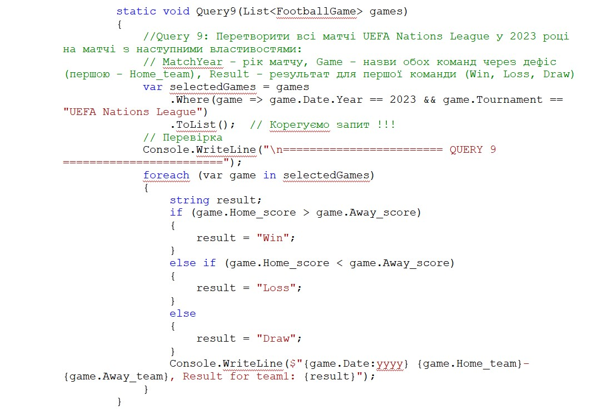

Запит 10: Вивести з 5-го по 10-тий (включно) матчі Gold Cup, які відбулися у липні 2023 р.
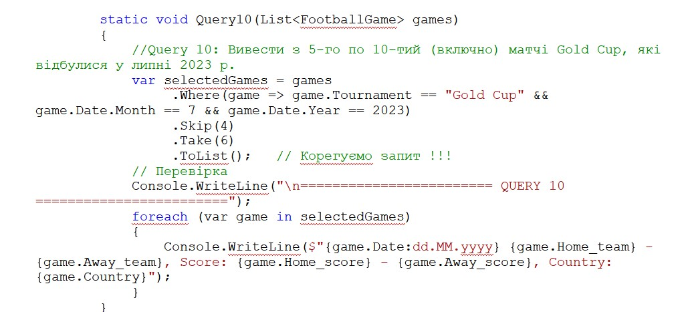

**РЕЗУЛЬТАТИ РОБОТИ ПРОГРАМИ**

Результат виконання Запиту 1
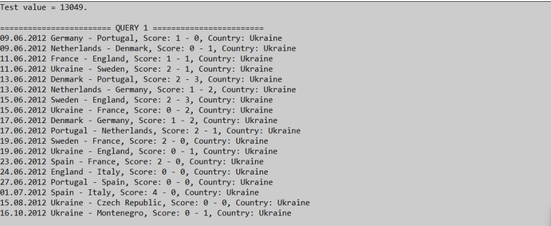

Результат виконання Запиту 2
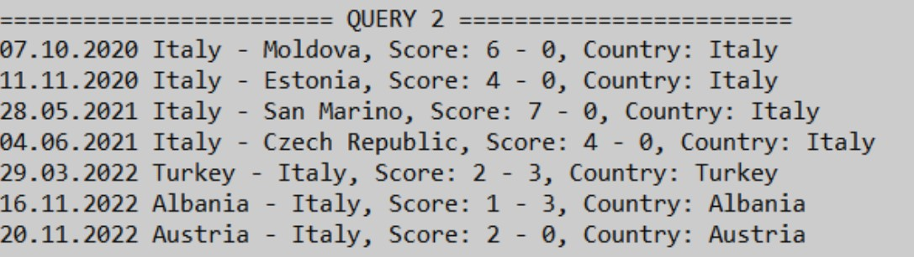

Результат виконання Запиту 3
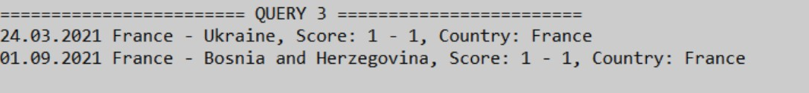

Результат виконання Запиту 4
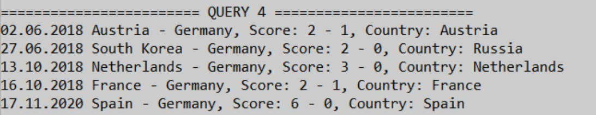

Результат виконання Запиту 5
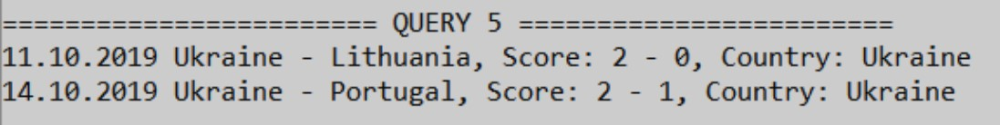

Результат виконання Запиту 6
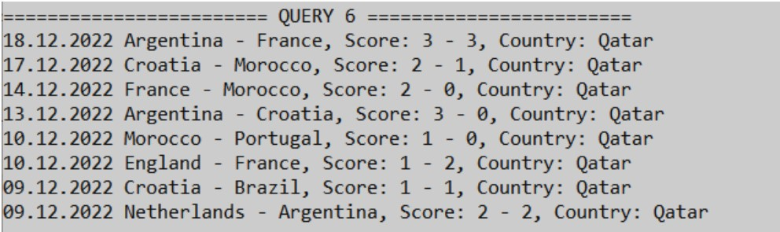

Результат виконання Запиту 7
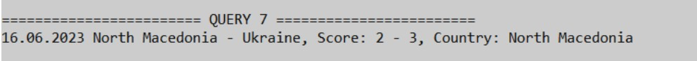

Результат виконання Запиту 8
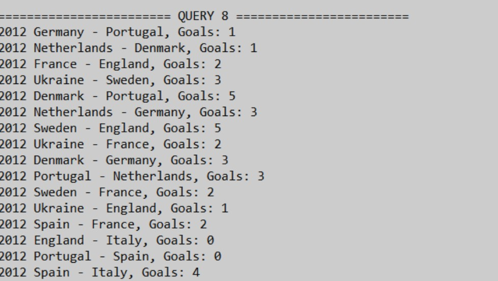

Результат виконання Запиту 9
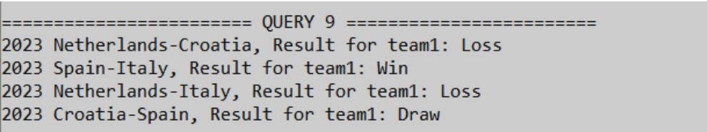

Результат виконання Запиту 10
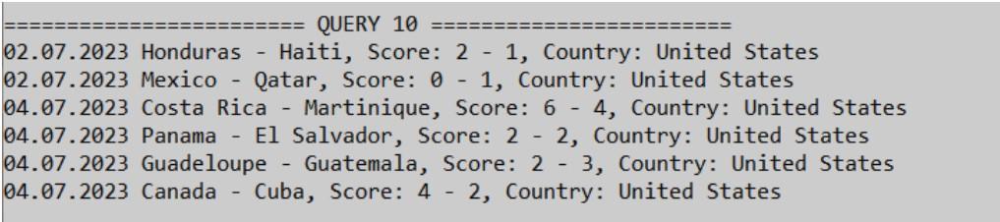

## ВИСНОВОК

В результаті виконання цієї практичної роботи отримала практичні навички роботи з LINQ. Розробила та реалізувала LINQ-запити Query1() до Query10(), які вирішують конкретні завдання, використовуючи дані про футбольні матчі. Провела тестування кожного LINQ-запиту та перевірила його результати, переконавшись, що вони відповідають очікуваним. Коректність виводу результатів навела на рисунках 1 – 10. Створила локальний та віддалений репозиторії, регулярно вносила коміти під час реалізації кожного запиту. Також створила та оформила файл README у віддаленому репозиторії.
